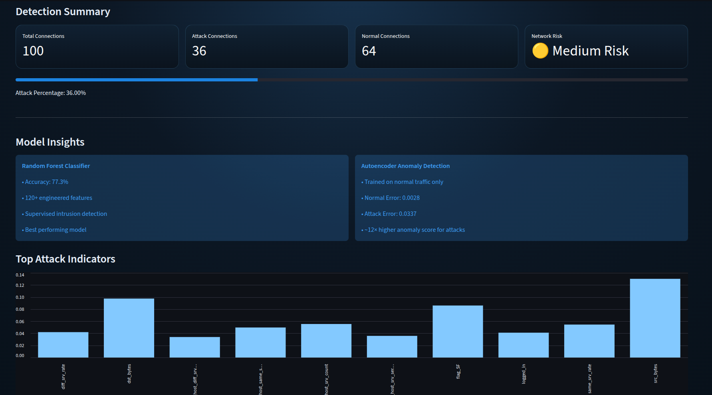

# Network Intrusion Detection System

A Machine Learning based cybersecurity application for detecting malicious network activity using both supervised and unsupervised learning techniques.

The system analyzes network traffic data and classifies connections as:

* Normal Traffic
* Intrusion / Attack

Built using Python, Scikit Learn, TensorFlow, Random Forest, Autoencoders, and Streamlit.

---

## Features

* Intrusion Detection using Random Forest
* Autoencoder Based Anomaly Detection
* CSV Upload Support
* Real Time Predictions
* Network Risk Assessment
* Feature Importance Visualization
* Downloadable Results
* Interactive Streamlit Dashboard

---

## Tech Stack

### Machine Learning

* Python
* Pandas
* NumPy
* Scikit Learn
* TensorFlow

### Models

* Random Forest Classifier
* Autoencoder

### Deployment

* Streamlit

---

## Dataset

NSL KDD Dataset

Files Included:

* KDDTrain+.txt
* KDDTest+.txt

The dataset contains network traffic information such as:

* Protocol Type
* Service
* Connection Flags
* Source Bytes
* Destination Bytes
* Login Information
* Connection Statistics
* Host Statistics

Target Variable:

* Normal Traffic (0)
* Attack Traffic (1)

---

## Machine Learning Pipeline

### Data Preprocessing

* Binary attack classification
* One Hot Encoding of categorical features
* Train and test feature alignment
* Feature scaling for Autoencoder training

### Feature Engineering

Applied encoding to:

* protocol_type
* service
* flag

Generated 120+ machine learning features.

### Random Forest Model

Configuration:

* n_estimators = 300
* max_depth = 20
* min_samples_split = 5

### Autoencoder Model

* Trained only on normal network traffic
* Reconstruction error based anomaly detection
* Compared against supervised classification performance

---

## Model Performance

### Random Forest

| Metric    | Score |
| --------- | ----- |
| Accuracy  | 77.3% |
| Precision | 97%   |
| Recall    | 62%   |
| F1 Score  | 76%   |

### Autoencoder

* Normal Traffic Mean Reconstruction Error: 0.0028
* Attack Traffic Mean Reconstruction Error: 0.0337
* Attack traffic generated approximately 12× higher reconstruction error than normal traffic.

---

## Key Findings

Top Features Influencing Intrusion Detection:

| Feature                | Importance |
| ---------------------- | ---------- |
| src_bytes              | 0.130      |
| dst_bytes              | 0.098      |
| flag_SF                | 0.086      |
| dst_host_srv_count     | 0.055      |
| same_srv_rate          | 0.055      |
| dst_host_same_srv_rate | 0.050      |
| diff_srv_rate          | 0.042      |
| logged_in              | 0.041      |

These features were the strongest indicators of malicious activity.

---

## Application Preview



---

## Sample Test Files

The repository includes sample files for testing:

* sample_network_traffic.csv
* normal_traffic.csv
* attack_traffic.csv
* demo_network_traffic.csv

These files can be uploaded directly into the Streamlit application.

---

## Project Structure

```text
NetworkIntrusionDetection/
│
├── app.py
├── intrusion.ipynb
├── model.pkl
├── columns.pkl
├── feature_importance.csv
├── KDDTrain+.txt
├── KDDTest+.txt
├── sample_network_traffic.csv
├── normal_traffic.csv
├── attack_traffic.csv
├── demo_network_traffic.csv
├── requirements.txt
├── README.md
└── image.png
```

---

## Installation

```bash
git clone https://github.com/mugdhachalla/network-intrusion-detection.git

cd network-intrusion-detection
```

Create a virtual environment:

```bash
python -m venv ml-env
```

Activate:

Linux/macOS

```bash
source ml-env/bin/activate
```

Windows

```bash
ml-env\Scripts\activate
```

Install dependencies:

```bash
pip install -r requirements.txt
```

---

## Run Application

```bash
streamlit run app.py
```

Application URL:

```text
http://localhost:8501
```

---

## Learning Outcomes

This project provided hands on experience with:

* Cybersecurity Machine Learning
* Intrusion Detection Systems
* Random Forest Classification
* Autoencoder Based Anomaly Detection
* Feature Engineering
* One Hot Encoding
* Model Evaluation
* Feature Importance Analysis
* Streamlit Deployment

---

## Author

Mugdha Challa
